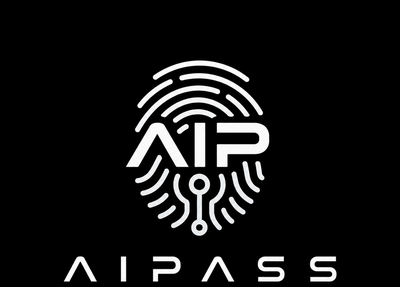
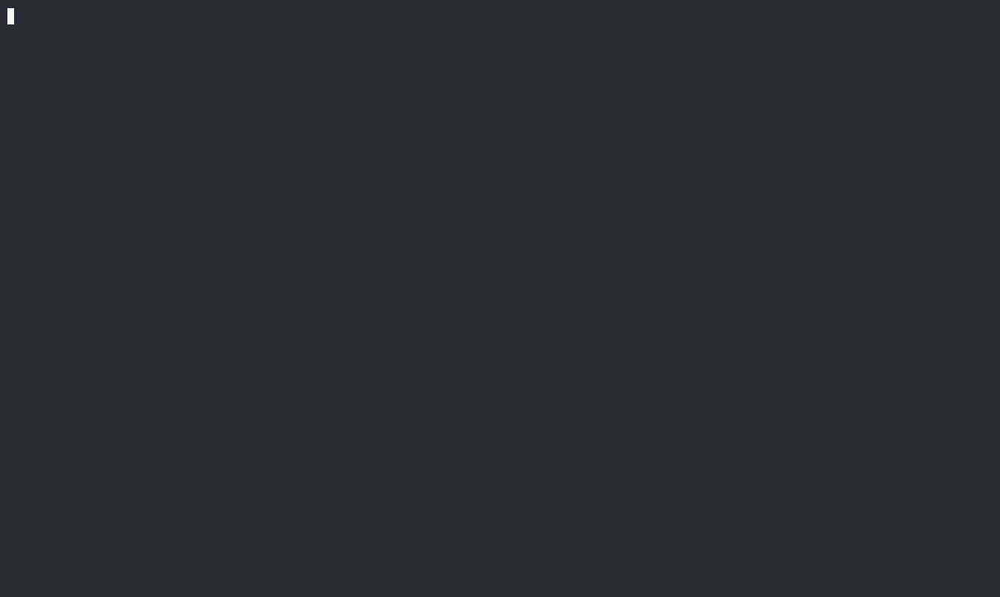

[](#project-status)
[](pyproject.toml)
[](LICENSE)
[](https://pypi.org/project/aipass/)
[](https://github.com/AIOSAI/AIPass/issues/new?template=feedback.yml)
[](https://codecov.io/gh/AIOSAI/AIPass)
[](https://scorecard.dev/viewer/?uri=github.com/AIOSAI/AIPass)
[](https://www.bestpractices.dev/projects/13095)
[](https://hvtracker.net/agents/aipass)

<p align="center">
  
</p>
<p align="center"><strong>Persistent Agent Workspace</strong></p>
<p align="center"><em>AI agents that remember, collaborate, and never start from zero.</em></p>



---

## The Problem

When the task gets complex, you become the coordinator — copying context between tools, dispatching work manually, keeping track of who's doing what. You are the glue holding your AI workflow together.

Multi-agent frameworks tried to fix this. But they isolate every agent in its own sandbox. Separate filesystems. Separate context. One agent can't see what another just built. Nobody picks up where a teammate left off.

That's not a team. That's a room full of people wearing headphones.

## What AIPass Does

AIPass is a CLI-native scaffold that adds **persistent memory, identity, and coordination** to your AI agents. You bring your project — AIPass adds the agent layer on top. No UI, no dashboard. You work in your terminal.

```bash
pip install aipass
mkdir my-project && cd my-project
aipass init run
```

A guided setup creates your project, your first agent, and opens a terminal where that agent is already running. Say "hi" — it knows who it is. Come back tomorrow — it remembers.

This is the base framework. It gives your agents the infrastructure to persist, communicate, and organize — everything else you build on top.

Here's what lands in your project:

```
my-project/
├── .aipass/                # Project config + prompts
├── .claude/                # Hooks (injected automatically)
├── src/my_project/
│   └── my_agent/
│       ├── .trinity/       # Identity + memory (3 JSON files)
│       ├── .ai_mail.local/ # Local mailbox
│       ├── apps/           # Your agent's code
│       └── README.md       # Domain knowledge
├── CLAUDE.md               # Project instructions
└── MY-PROJECT_REGISTRY.json
```

Everything is plain files. No daemon, no hidden state. Delete the directory and it's gone.

**Start with one agent.** Add more when you need them:

```bash
aipass init agent my-agent            # Full agent: apps, mail, memory, identity
```

**What makes this different:**

- **Agents are persistent.** They remember across sessions. Expertise develops over time. Nobody starts from zero.
- **Bring your own project.** AIPass adds agent infrastructure to whatever you're building. It's a scaffold, not a product — you shape it.
- **Everything is local.** Memory is JSON files. Communication is local mailbox files. No cloud, no external APIs.
- **Shared workspace.** All agents work on the same filesystem, same project, same time. No sandboxes.
- **One command for everything.** AIPass ships with `drone`, a CLI router — `drone @agent command` reaches any agent. Learn it once, use it everywhere.

**Runs on your existing CLI subscription.** Claude Pro/Max or Codex — AIPass uses the same CLI binary you already run. No extra API keys, no extra costs for core functionality.

---

## Quick Start

### Your own project

```bash
pip install aipass

mkdir my-project && cd my-project
aipass init run                       # Guided setup — project, first agent, terminal handoff
```

That's it. Your agent has identity, memory, a mailbox, and access to every AIPass service — planning, quality audits, dispatch, real-time monitoring. All through `drone @branch command`.

```bash
aipass init                           # Just the scaffold (no guided setup)
aipass init agent my_agent            # Add another agent
aipass doctor                         # Check system health
```

> **Need help?** [Ask in Discussions](https://github.com/AIOSAI/AIPass/discussions) or [file feedback](https://github.com/AIOSAI/AIPass/issues/new?template=feedback.yml) — both take 30 seconds.

### Explore the full framework

Clone the repo to see all 13 agents working together — the reference implementation:

```bash
git clone https://github.com/AIOSAI/AIPass.git
cd AIPass
./setup.sh                            # Creates venv, installs, bootstraps 13 agents

cd src/aipass/devpulse
claude                                # Talk to the orchestrator
```

```bash
# Things you can do:
aipass doctor                            # Check system health
drone @seedgo audit aipass               # Run automated quality checks across all agents
drone @flow create . "Add user auth"     # Create a work plan
drone @ai_mail dispatch @agent "Sub" "Body"  # Send task + wake an agent
```

---

## How It Works

**One agent:** Run `aipass init run` and in 5 minutes you have a project with an agent that reads `.trinity/` on startup and picks up where it left off. Memory starts as plain JSON files — no setup required. When they fill up, older entries automatically archive into ChromaDB for long-term search. Nothing is lost.

**A team:** When one agent isn't enough, every agent shares the same structure:

```
src/my-project/<agent>/
├── .trinity/           # Identity + memory (persists across sessions)
├── .ai_mail.local/     # Mailbox (receives tasks, sends results)
├── apps/               # Entry point → modules → handlers
└── README.md           # Domain knowledge (the agent reads this on startup)
```

Identical layout everywhere. If you know one agent, you know all of them. `drone` is the single command that routes to any agent:

```bash
drone @branch command [args]    # Every agent, every task. Drone handles routing.
```

```bash
drone @seedgo audit my_project               # Run quality checks on everything
drone @flow create . "Refactor auth module"  # Create a work plan
drone @ai_mail dispatch @agent "Archive old sessions" "Find sessions older than 30 days"
```

**Two ways to use AIPass:**

- **Your own project:** `aipass init run` sets up a new project with your first agent. Add more agents as you need them. Your first agent is the orchestrator — it coordinates the others.
- **The full framework:** Clone the repo to work with all 13 core agents. Talk to `devpulse` (the orchestrator), dispatch work across specialists. Agents work in parallel and report back.

---

## The Reference Implementation

AIPass ships with 13 core agents that maintain and develop the framework itself — proving the architecture works at scale. You don't need any of these to use AIPass in your own project. They're here as examples and as services your project can call.

```
devpulse (orchestrator)
   ├── aipass   — concierge + onboarding (aipass init, doctor, profile)
   ├── drone    — command routing + @agent resolution
   ├── seedgo   — automated quality standards
   ├── prax     — real-time monitoring across all agents
   ├── ai_mail  — agent-to-agent communication + task dispatch
   ├── flow     — plan lifecycle, templates, auto-archival
   ├── spawn    — creates new agents anywhere on your filesystem
   ├── hooks    — hook engine, sound control, per-project config
   ├── memory   — automatic archival, ChromaDB, semantic search
   ├── api      — LLM access layer (OpenRouter, multi-provider)
   ├── trigger  — event-driven automation + self-healing
   └── cli      — terminal formatting and rich output
```

These agents work on the **same filesystem, same project, same time** — no sandboxes, no worktrees. This is the pattern your projects inherit.

<details>
<summary>Agent details</summary>

**You interact with one:** [**devpulse**](src/aipass/devpulse/README.md) — the orchestrator. You talk to it, it coordinates everyone else.

**Core infrastructure** — how agents connect:

| Agent | Role |
|-------|------|
| [**aipass**](src/aipass/aipass/README.md) | Concierge — `aipass init`, doctor, profile, onboarding |
| [**drone**](src/aipass/drone/README.md) | Routes `drone @branch command` to the right agent |
| [**ai_mail**](src/aipass/ai_mail/README.md) | Agent-to-agent messaging and task dispatch |
| [**memory**](src/aipass/memory/README.md) | Memory lifecycle — automatic archival, ChromaDB vectors, semantic search |
| [**api**](src/aipass/api/README.md) | LLM access layer — multi-provider routing (OpenRouter) |
| [**spawn**](src/aipass/spawn/README.md) | Creates new agents from templates |

**Quality and operations** — how the system stays healthy:

| Agent | Role |
|-------|------|
| [**seedgo**](src/aipass/seedgo/README.md) | Automated quality standards, enforced across all agents |
| [**prax**](src/aipass/prax/README.md) | Real-time monitoring, logs, dashboards |
| [**flow**](src/aipass/flow/README.md) | Plan lifecycle — multiple template types, auto-archival, vector verification |
| [**hooks**](src/aipass/hooks/README.md) | Hook engine — per-project config, sound control, event dispatch |
| [**trigger**](src/aipass/trigger/README.md) | Event-driven automation + self-healing |
| [**cli**](src/aipass/cli/README.md) | Terminal formatting and rich output |

</details>

---

## CLI Support

AIPass is built and tested with **Claude Code** on Linux/WSL.

| CLI | Autonomous Mode | Status |
|-----|----------------|--------|
| [Claude Code](https://code.claude.com/docs) | `claude -p "prompt" --permission-mode bypassPermissions` | Fully tested |
| [Codex](https://github.com/openai/codex) | `codex exec "prompt" --dangerously-bypass-approvals-and-sandbox` | Experimental |

setup.sh auto-detects which CLIs are installed and configures hooks for each.

---

## Project Status

**Beta.** Actively developed by a solo developer working with the AI agents themselves — every PR, every test, every fix is human-AI collaboration.

| Metric | Value |
|--------|-------|
| Version | [](https://pypi.org/project/aipass/) |
| Agents | 13 core + user-created |
| Quality | Automated standards enforced across every agent |
| Coverage | [](https://codecov.io/gh/AIOSAI/AIPass) — 75% minimum, CI-gated |
| Tests | Extensive — every agent ships its own suite |

Each agent documents its own operational status in its branch README — what works, what doesn't, and why.

---

## Requirements

- Python 3.10+
- [Claude Code](https://code.claude.com/docs)
- Linux, macOS, or WSL (all CI-tested)
- `sudo` access optional (for `/usr/local/bin` symlinks — falls back to `~/.local/bin` without sudo)
- API keys optional (OpenRouter/OpenAI — for optional add-on agents)

## Roadmap

These items have partial work done and are under ongoing testing:

- **macOS support** — CI green, full test suite passing ([#360](https://github.com/AIOSAI/AIPass/issues/360))
- **Windows native** — CI green, full test suite passing
- **Codex CLI** — hooks and AGENTS.md wired, needs end-to-end testing
- **Fork contributor workflow** — improved error handling for fork-based PRs ([#329](https://github.com/AIOSAI/AIPass/issues/329))

---

<details>
<summary>Uninstall</summary>

### Remove AIPass from a project

AIPass stores everything locally in your project directory. To remove it:

```bash
# Remove AIPass files from your project
rm -rf .aipass/ .claude/ .ai_mail.local/ hooks/ src/
rm -f CLAUDE.md AGENTS.md *_REGISTRY.json .gitignore

# If you installed via pip
pip uninstall aipass
```

No cloud accounts, no external services, no cleanup beyond your local filesystem.

### Remove a single agent

Use spawn's delete command to cleanly archive and deregister:

```bash
drone @spawn delete @agent_name
```

This archives the agent's directory and removes it from the registry.

</details>

<details>
<summary>Subscriptions & Compliance</summary>

### Use your existing subscription

AIPass runs on your **existing CLI subscription** — Claude Pro/Max or Codex. No API keys required for core functionality. No extra costs beyond your existing subscription.

This works because AIPass runs each CLI as an **official subprocess** — the same binary you'd run yourself in a terminal. It doesn't extract credentials, proxy API calls, or intercept tokens. Your subscription stays within the provider's infrastructure at all times.

### What AIPass does NOT do

- Extract or redirect subscription OAuth tokens
- Intercept CLI-to-provider communication
- Bypass rate limits or prompt caching
- Impersonate official CLI clients

Claude Code is proprietary but officially supports hooks and subprocess usage. Codex CLI is open source (Apache 2.0).

> API keys are only needed for optional add-on agents (OpenRouter/OpenAI). For server/automated deployments, API key authentication is recommended per [Anthropic's guidance](https://code.claude.com/docs/en/legal-and-compliance).

</details>
